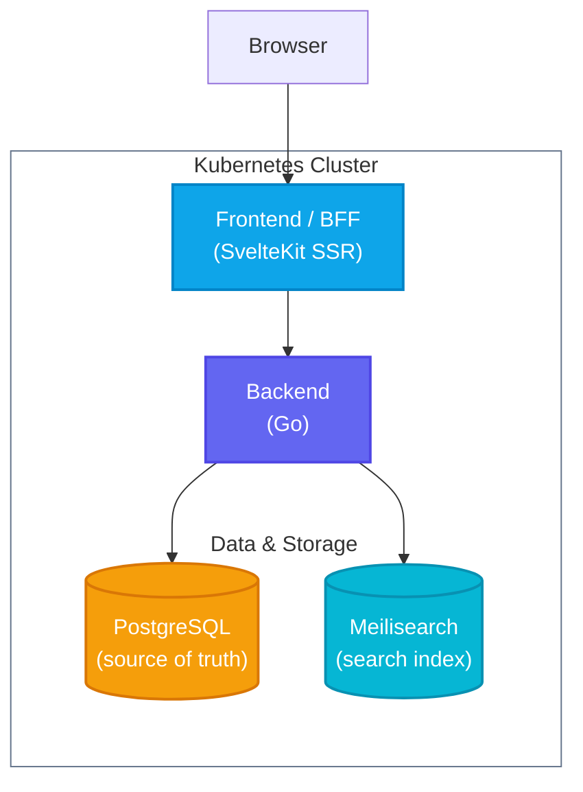

# Phasma

**Phasma** is a full-stack image-sharing platform built with a production-grade architecture. Combining a robust Go API with a modern SvelteKit frontend, it provides a seamless experience for users to upload, browse, and interact with images.

[](https://www.youtube.com/watch?v=nTqpn376k_g)

## Features

- **Image sharing**: Upload, browse, like, and comment on images with a responsive feed and profile pages.
- **Social feed**: Personalized feed of posts from followed users, pre-materialized on write by a Kafka consumer group (fan-out on follow/post).
- **Notifications**: Real-time like, comment, and follow notifications with unread badge and mark-as-read support.
- **Rich text**: Captions, comments, and bios render `@mention`, `#hashtag`, and URL links. Compose typeahead suggests users and hashtags as you type.
- **Global search**: Search users, posts, and hashtags with paginated results. A leading `#` scopes results to hashtag-filtered posts.
- **Object storage**: Image bytes are stored in SeaweedFS (S3-compatible), decoupled from the database and served with `Cache-Control` and `ETag` headers.
- **Cache layer**: Dragonfly (Redis-protocol) backs rate-limit token buckets and login-failure counters, keeping the hot path off PostgreSQL.
- **Event streaming**: Every domain mutation writes to a transactional outbox. Redpanda Connect reads the PostgreSQL WAL via CDC and publishes to Redpanda (Kafka-compatible) topics consumed by the notifications and feed workers and the Meilisearch sync pipeline.
- **Session management**: Argon2id password hashing, HMAC-keyed session tokens, per-user session listing and remote revocation.
- **Production-ready**: Stateless Go API, bounded concurrency, absolute session lifetimes, dependency-aware readiness probe, structured JSON logging, circuit breaker and retry-with-backoff on every database call.
- **HA-ready**: Ships at `replicas: 1` but correct at `replicas: N`. No shared in-process state; the outbox is CDC-based (no polling) and all consumers use idempotent inserts with `ON CONFLICT DO NOTHING`.

## Architecture



| Service | Language | Description |
| --- | --- | --- |
| [frontend](/apps/frontend) | TypeScript | SvelteKit SSR application; sole public entry point and BFF. |
| [backend](/apps/backend) | Go | HTTP API handling users, sessions, images, likes, and uploads. |
| [database](/apps/database) | PostgreSQL | Schema migrations managed by `migrate/migrate`. |

### Infrastructure

Six in-cluster services run alongside the application:

- **PostgreSQL** — Primary source of truth for all application data.
- **Dragonfly** — Redis-protocol cache backing rate-limit token buckets and login-failure counters. The API fails open on unavailability.
- **SeaweedFS** — S3-compatible object store holding image bytes. The API streams blobs directly; no image data touches PostgreSQL.
- **Meilisearch** — Derived search index. PostgreSQL is the only source of truth; Meilisearch is populated and kept current via the Redpanda CDC pipeline.
- **Redpanda** — Kafka-compatible event broker. Receives `entity-changes` and `activity` events published by Redpanda Connect; consumed by the backend's `notifications-consumer` and `feed-consumer` goroutines.
- **Redpanda Connect** — Stateless CDC relay. Reads new `outbox` rows from the PostgreSQL WAL and publishes to Redpanda. Also drives the Meilisearch sync and S3 cleanup pipelines.

## Docs

Architectural specs live in [`docs/`](/docs/):

| Doc | Contents |
| --- | --- |
| [architecture.md](/docs/architecture.md) | Service topology, request flow, integration patterns |
| [api.md](/docs/api.md) | HTTP endpoints, middleware stack, pagination |
| [data-model.md](/docs/data-model.md) | Schema, indexes, entity relationships, domain invariants |
| [security.md](/docs/security.md) | Session model, password policy, ownership rules, rate limiting |
| [business-rules.md](/docs/business-rules.md) | Validation constraints, ordering, content policy |
| [frontend.md](/docs/frontend.md) | Route map, layout hierarchy, SSR, data fetching |
| [design-system.md](/docs/design-system.md) | Theme, component inventory, layout |
| [infrastructure.md](/docs/infrastructure.md) | Kubernetes resources, secrets, probes, storage |

## Deploy

Deploy the application to your active Kubernetes cluster using the provided script:

```sh
./scripts/deploy.sh
```

The script builds the Docker images, creates the Kubernetes namespace (`phasma` by default) and resources, waits for pods to be ready, and starts a port-forward to the frontend at http://localhost:8080/. It is idempotent and safe to re-run for updates.

## Cleanup

To remove all deployed resources and the namespace:

```sh
kubectl delete -f ./deploy -n phasma
kubectl delete namespace phasma
```

## Testing

Run all unit tests across the frontend and backend:

```sh
make test
```

## License

Licensed under the [MIT](LICENSE) License.
