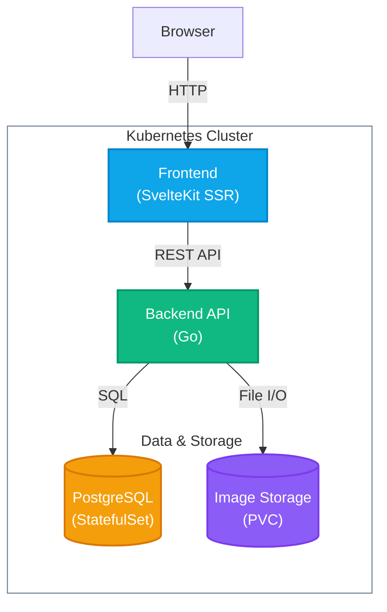

# Pixelgram

**Pixelgram** is a full-stack image-sharing platform built with a production-grade architecture. Combining a robust Go API with a modern SvelteKit frontend, it provides a seamless experience for users to upload, browse, and interact with images.

[](https://www.youtube.com/watch?v=nTqpn376k_g)


## Features

- **Monolithic Backend**: Single Go service handling users, sessions, images, likes and uploads, backed by PostgreSQL.
- **Production-Ready & HA**: Fully containerized, stateless service designed for High Availability deployments on Kubernetes.
- **Resilience**: Built-in rate limiting, circuit breaker and retry-with-backoff protecting the API and the database layer.
- **Observability**: Structured JSON logging with request ID propagation across the request lifecycle.
- **Modern Frontend**: Built with SvelteKit, Tailwind CSS, DaisyUI and Lucide icons.

## Architecture



| Service | Language | Description |
| --- | --- | --- |
| [backend](/apps/backend) | Go | HTTP API handling users, sessions, images, likes and uploads. |
| [database](/apps/database) | PostgreSQL | Schema migrations managed by `migrate/migrate`. |
| [frontend](/apps/frontend) | TypeScript | SvelteKit SSR application styled with Tailwind CSS and DaisyUI. |

## Deploy

Deploy the application to your active Kubernetes cluster using the provided script:

```sh
./scripts/deploy.sh
```

The script builds the Docker images, creates the Kubernetes namespace (`pixelgram` by default) and resources, waits for pods to be ready, and starts a port-forward to the frontend at http://localhost:8080/. It is idempotent and safe to re-run for updates.

## Cleanup

To remove all deployed resources and the namespace:

```sh
kubectl delete -f ./deploy -n pixelgram
kubectl delete namespace pixelgram
```

## Testing

Run all unit tests across the frontend and backend using the provided `Makefile` target:

```sh
make test
```

## License

Licensed under the [MIT](LICENSE) License.
