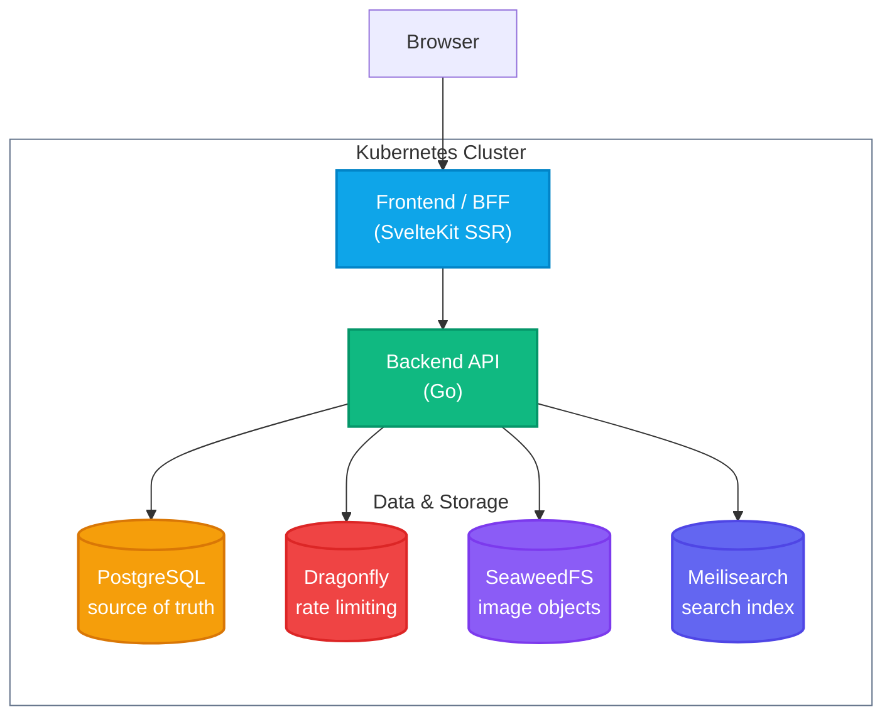

# Pixelgram

**Pixelgram** is a full-stack image-sharing platform built with a production-grade architecture. Combining a robust Go API with a modern SvelteKit frontend, it provides a seamless experience for users to upload, browse, and interact with images.

[](https://www.youtube.com/watch?v=nTqpn376k_g)


## Features

- **Image sharing**: Upload, browse, like, and comment on images with a responsive feed and profile pages.
- **Rich text**: Captions, comments, and bios render `@mention`, `#hashtag`, and URL links. Compose typeahead suggests users and hashtags as you type.
- **Global search**: Search users, posts, and hashtags with paginated results. A leading `#` scopes results to hashtag-filtered posts.
- **Object storage**: Image bytes are stored in SeaweedFS (S3-compatible), decoupled from the database and served with `Cache-Control` and `ETag` headers.
- **Cache layer**: Dragonfly (Redis-protocol) backs rate-limit token buckets and login-failure counters, keeping the hot path off Postgres.
- **Search index**: Meilisearch holds a derived search index fed by a transactional outbox — every post, user, and hashtag change is indexed asynchronously without blocking the write path.
- **Production-ready**: Stateless Go API, Argon2id password hashing with bounded concurrency, absolute session lifetimes, dependency-aware readiness probe, structured JSON logging, circuit breaker and retry-with-backoff on every database call.
- **HA-ready**: Ships at `replicas: 1` but correct at `replicas: N`. No shared in-process state; the outbox worker uses `SELECT FOR UPDATE SKIP LOCKED` with LISTEN/NOTIFY so replicas coordinate without a central lock.

## Architecture



| Service | Language | Description |
| --- | --- | --- |
| [backend](/apps/backend) | Go | HTTP API handling users, sessions, images, likes, and uploads. |
| [database](/apps/database) | PostgreSQL | Schema migrations managed by `migrate/migrate`. |
| [frontend](/apps/frontend) | TypeScript | SvelteKit SSR application styled with Tailwind CSS and DaisyUI. |

### Infrastructure

Three in-cluster datastores run as `StatefulSet`s alongside the application:

- **Dragonfly** — Redis-protocol cache backing rate-limit token buckets and login-failure counters. Ephemeral; the API fails open on unavailability.
- **SeaweedFS** — S3-compatible object store holding image bytes. The API streams blobs directly; no image data touches Postgres.
- **Meilisearch** — Derived search index. Postgres is the only source of truth; Meilisearch is populated and kept current by the transactional outbox worker. The index can be rebuilt at any time by replaying the outbox.

## Deploy

Deploy the application to your active Kubernetes cluster using the provided script:

```sh
./scripts/deploy.sh
```

The script builds the Docker images, creates the Kubernetes namespace (`pixelgram` by default) and resources, waits for pods to be ready, and starts a port-forward to the frontend at http://localhost:8080/. It is idempotent and safe to re-run for updates.

## Cleanup

To remove all deployed resources and the namespace:

```sh
kubectl delete -f ./deploy -n pixelgram
kubectl delete namespace pixelgram
```

## Testing

Run all unit tests across the frontend and backend using the provided `Makefile` target:

```sh
make test
```

## License

Licensed under the [MIT](LICENSE) License.
